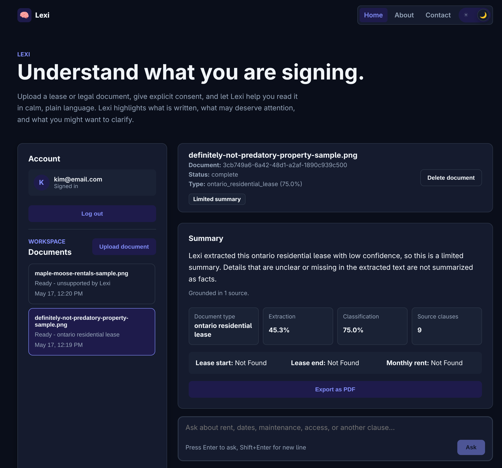
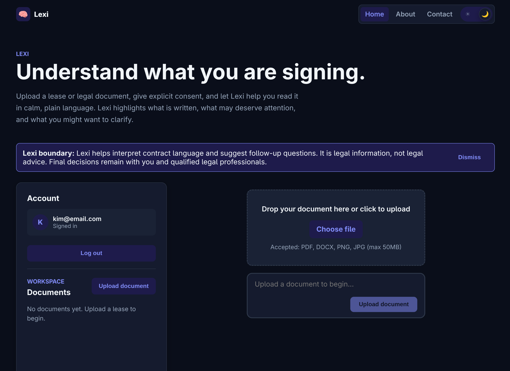
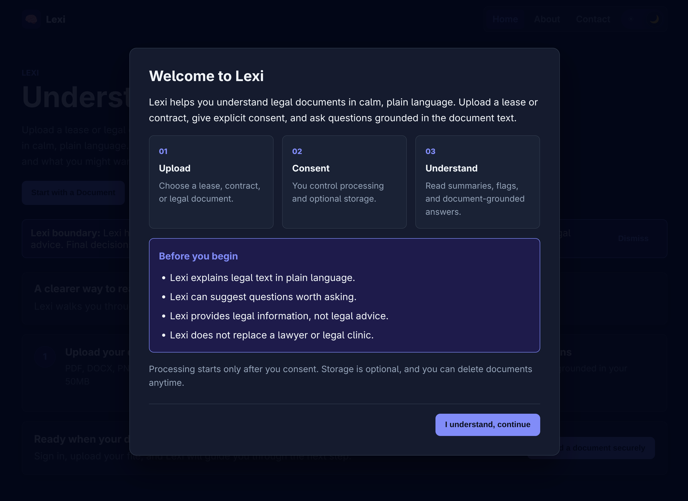
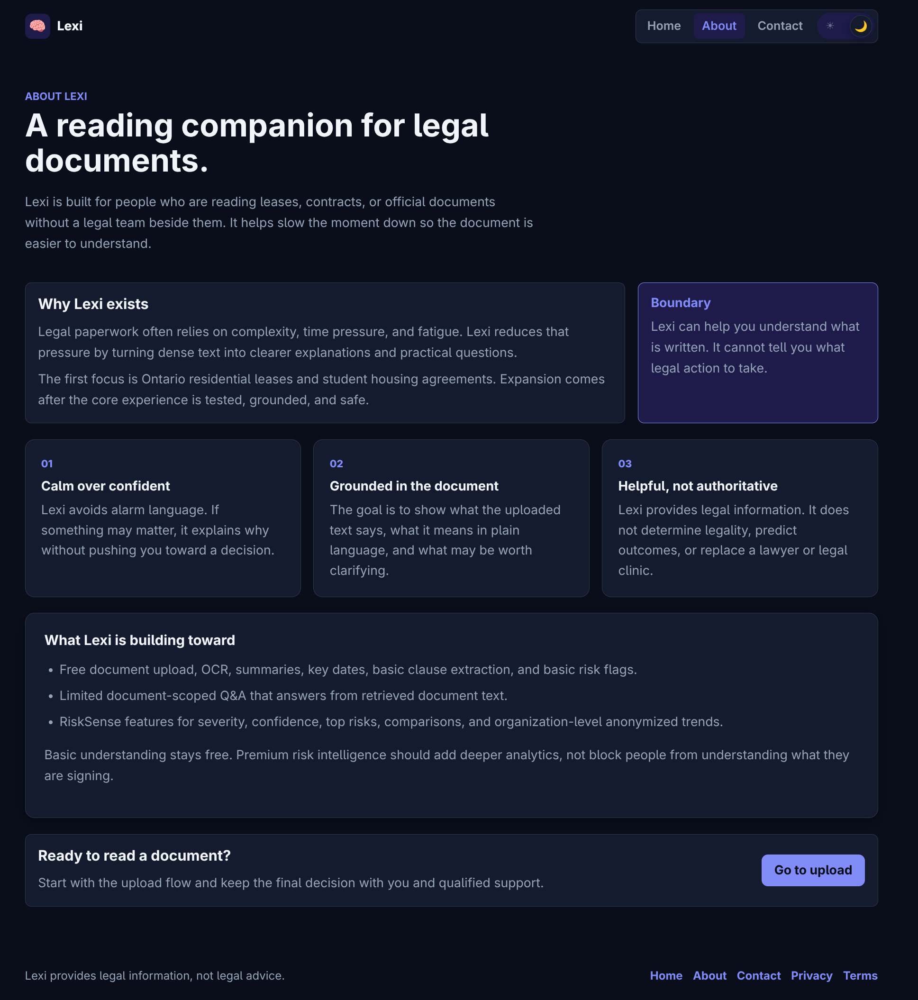

# 🧠 Lexi Intelligence System

**Lexi** is a legal understanding engine that turns dense legal documents into clear, plain-English explanations using a **hybrid AI pipeline** built on **OCR, PyTorch, Hugging Face, LLMs, and Retrieval-Augmented Generation (RAG)**.

Upload a lease, contract, or official letter.
Lexi explains what it says, what matters, and what deserves attention so people are not overwhelmed, misled, or quietly taken advantage of.

> ⚠️ **Lexi provides legal information, not legal advice.**
> Lexi helps people understand documents and ask better questions. Final decisions remain with users and qualified legal professionals.

---

## Quick Contributor Onboarding

From the repository root:

```bash
./scripts/onboarding/setup-dev.sh
./scripts/onboarding/start-dev.sh
./scripts/onboarding/check-health.sh
python3 scripts/onboarding/validate-setup.py
```

This gives contributors a direct setup path with clear checks.
`mamba` is preferred for faster Python environment setup; the scripts fall back to `conda` when needed.

---

## ✨ What Lexi does

Lexi exists to protect people from being **steamrolled** by paperwork.

**Steamrolling** is not always scamming, but it often leads to the same harm.
It happens when complexity, fatigue, and power imbalance replace informed consent.

Lexi slows the process down.

**Core flow**
1. Upload a document (PDF, DOCX, image, or scan)
2. Lexi extracts and structures the text
3. Lexi classifies the document and its sections
4. Lexi explains the document in plain language
5. Lexi flags risks, unusual clauses, and deadlines
6. Lexi suggests questions users can ask before signing

**Near-term product direction**

Lexi is moving toward a document-centered conversation workspace:

- users sign in and acknowledge that Lexi provides legal information, not legal advice
- a sidebar helps users return to their own processed documents
- the main workspace keeps the active document, summary, source excerpts, and Q&A together
- chat answers stay scoped to the selected document and cite source text
- unsupported or uncertain documents are stopped gracefully instead of treated like legal files

---

## 📸 Product screenshots

Lexi’s current desktop experience centers on a calm document workspace: upload, consent, summary, source excerpts, and scoped Q&A stay close to the document being reviewed.



| Home | Onboarding |
| --- | --- |
|  |  |



---

## 🧬 Why it’s called Lexi

**Lexi** comes from *lexis* (Greek: word, meaning) and is associated with language and understanding.

It also carries a deeper meaning:
> **Helper of mankind**

Lexi exists to protect people from corporate and institutional behavior that hides harm behind legal complexity, fine print, and exhaustion.
She stands with the person reading alone, unsure if they are about to make a costly mistake.

---

## 🎯 Who Lexi is for

- Students
- Renters
- Newcomers
- Precarious workers
- Anyone signing legal documents without a legal team

Lexi is used by **RiseUp**, **fLOKr**, and other community-focused tools where understanding is a form of protection.

---

## 🚧 What Lexi is not

Lexi has strict boundaries:

- ❌ Not a lawyer
- ❌ Not legal advice
- ❌ Does not determine legality
- ❌ Does not predict legal outcomes

Lexi **does**:
- Explain what is written in a document
- Ground explanations in actual clauses
- Highlight risk, ambiguity, and missing clarity
- Encourage consultation with legal clinics or lawyers

If Lexi is unsure, she says so.

---

## 🧩 Core capabilities

- 📥 **Document ingestion with explicit consent**
- 🔍 **OCR and text extraction**
- 🧭 **Document and clause classification**
- 🧠 **Plain-English explanations**
- 🚩 **Risk and attention flags**
- ⏰ **Deadlines and key dates**
- ❓ **Suggested questions to ask**
- 💬 **Scoped follow-up Q&A (document-only)**

---

## 💸 Product model: free understanding, premium risk intelligence

Lexi’s free tier is mission-critical, not a teaser.

**Free Lexi:** *Understand what you’re signing.*
- Document upload
- OCR and text extraction
- Plain-English summaries
- Basic clause extraction
- Key dates and metadata
- Basic risk flags
- Limited document-scoped Q&A

Basic legal understanding must not be paywalled.

**Premium Lexi Risk Intelligence:** *Understand the risks before they become expensive.*
- Advanced risk scoring and severity levels
- Confidence scoring across OCR, classification, extraction, and LLM outputs
- Financial impact estimation
- Lease comparison
- Renewal and penalty forecasting
- Pattern detection across documents
- Prioritized “top risks” summaries
- AI-generated negotiation or clarification questions
- Document history and monitoring

Premium adds deeper risk analytics. It does **not** turn Lexi into legal advice.

**Organization plans** may support tenant unions, student associations, nonprofits, and legal clinics through:
- Aggregated anonymized risk trends
- Bulk document analysis
- Pattern detection across leases or contracts
- Dashboards for recurring exploitative clauses
- Exportable reports for advocacy, education, or clinic workflows

All organization analytics must be anonymized, consent-aware, and privacy-preserving.

---

## 🧠 Lexi’s AI architecture (LLM + RAG, explicitly)

Lexi is a **hybrid intelligence system**.
LLMs are powerful, but they are never allowed to freestyle.

Lexi combines **deterministic parsing, ML models, and retrieval-augmented generation** to keep explanations grounded in source documents.

### 🔹 Layer 1: Document understanding (Deterministic + ML)
- OCR and layout detection
- Clause and section extraction
- PyTorch classifiers for:
  - Document type (lease, contract, letter)
  - Clause categories (termination, fees, access, penalties)
- Hugging Face transformers for tagging and embeddings

Purpose: **structure, signals, and grounding**

---

### 🔹 Layer 2: Retrieval-Augmented Generation (RAG)
- Documents are split into clause-level chunks
- Each clause is embedded using transformer models
- Embeddings are stored in a vector store (pgvector or Qdrant)

When a question is asked:
1. Relevant clauses are retrieved (top-K)
2. Only those clauses are passed to the LLM
3. The LLM is instructed to answer using **only retrieved text**

If the answer is not present, Lexi says so.

Purpose: **control context and prevent hallucination**

---

### 🔹 Layer 3: LLM reasoning and language
LLMs are used for:
- Plain-English explanations
- Summaries grounded in retrieved clauses
- Question generation
- Scoped document Q&A

LLMs are **never** used to:
- Declare legality
- Predict outcomes
- Invent facts or rules

Purpose: **translation and clarity, not authority**

---

### 🔹 Layer 4: Risk intelligence and analytics
Lexi’s premium analytics layer may include a dedicated risk module such as:
- `RiskSense`
- `Lexi Risk Engine`
- `/risk`
- `/analytics`

This layer uses actuarial-style risk analytics to prioritize attention, estimate possible financial exposure, and identify recurring patterns.

It is **not** used to:
- Decide what a user should do
- Declare that a clause is legal or illegal
- Expose individual documents in organization dashboards
- Scare users with inflated risk language

Purpose: **prioritization and prevention, not prediction or legal authority**

---

## 🛡️ Safety and guardrails

Lexi is built with non-negotiable safeguards:

- Legal information only, enforced at system and prompt level
- Clause-grounded explanations by default
- Honest uncertainty when confidence is low
- Free access to basic document understanding
- Premium risk analytics that remain informational, not advisory
- Jurisdiction-aware and conservative language
- Privacy-first document handling
- One-click deletion and opt-in storage

Lexi never trades confidence for correctness.

---

## 🧱 Architecture overview

Lexi is a **shared intelligence layer** used by multiple applications.

High-level flow:

Upload → OCR / Parsing → Classification → Chunking & Embeddings → Retrieval (RAG) → LLM Explanation → Risk Flags → Report

Different frontends share the same Lexi brain while maintaining their own UI and tone.

---

## 🛠️ Tech stack

Designed to be **ML-first, inspectable, and production-ready**.

### Backend
- Python
- FastAPI (REST API, OpenAPI, async)
- Uvicorn (ASGI server)
- Celery or RQ (background processing)

### Frontend
- Next.js App Router
- React
- Framer Motion
- Playwright and Vitest for frontend testing
- Netlify for frontend deployment

### AI & ML
- PyTorch (custom model training)
- Hugging Face Transformers (classification, embeddings)
- LLM via API (summarization, explanation, Q&A)
- Retrieval-Augmented Generation (RAG)
- pgvector or Qdrant (vector search)

### Document processing
- pypdf / pdfminer.six (PDF parsing)
- pytesseract + Pillow (OCR for scans and photos)

### Data
- PostgreSQL (metadata and reports)
- SQLite only for fast, isolated automated tests
- Encrypted object storage (S3-compatible)

### Security & privacy
- Encryption at rest
- Ephemeral processing option
- Explicit consent and deletion flows
- Custom JWT auth for private MVP
- Supabase Auth chosen for public beta

### Integrations
- RiseUp
- fLOKr
- Future community and legal-aid tools

---

## 📁 Repository structure

```
lexi/
├── backend/              FastAPI API, Celery worker, services, ML/RAG code, tests
├── frontend/             Next.js app for upload, consent, processing, results, account flows
├── docs/
│   ├── media/            Screenshots and sample document images used in docs
│   ├── product/          Vision, roadmap, tone, styles, user testing
│   └── technical/        Setup, design, requirements, API contract, task board
├── scripts/
│   └── onboarding/       Setup, startup, health check, validation helpers
├── docker-compose.yml    Local backend stack: API, worker, Postgres, Redis, MinIO, Qdrant
├── environment.yml       Mamba/Conda Python environment for local tooling and tests
├── netlify.toml          Netlify frontend deployment config
└── pyproject.toml        Python package metadata and dev tooling
```

---

## 🚦 Project status

Lexi is an **active technical MVP** moving toward a private beta for Ontario residential leases.

Current state:
- Backend Docker stack is running: API, Celery worker, PostgreSQL, Redis, MinIO, and Qdrant
- Database migrations apply on API startup
- Backend API and live browser E2E gates pass
- A Postgres-backed browser E2E gate exists for release cuts and public-beta milestones
- Frontend MVP exists for provider-aware auth, upload, consent, processing status, results, deletion, document workspace, Q&A, and print/export flow
- RAG scaffolding, deterministic backend summaries, a local real-provider adapter, low-confidence fallback, guarded document-scoped Q&A, unsupported-document guardrails, and the first RiskSense MVP slice exist
- Current product screenshots are captured in `docs/media/screenshots/` and displayed in this README

See the [technical design](docs/technical/design.md) and [project requirements](docs/technical/requirements.md).

Near-term focus:
1. Improve the reliability and usefulness of Lexi’s summaries, Q&A, and RiskSense output
2. Evaluate output quality against saved screenshots, sample lease scenarios, and real Ontario lease examples
3. Keep extraction edge-case unit tests tracked, but intentionally deferred until the next output-quality pass defines the target behavior

For the full phased plan, see the [product roadmap](docs/product/roadmap.md).

---

## 🤝 Contributing

Lexi welcomes contributors who care about accessibility, privacy, plain language, ethical AI, and community protection.

Start with [CONTRIBUTING.md](CONTRIBUTING.md), then read the [setup guide](docs/technical/SETUP.md) and [roadmap](docs/product/roadmap.md).

---

## 🧡 Why Lexi exists

Because complexity should never be used to extract money, time, or dignity.

Lexi helps people slow down, understand what they are signing, and protect themselves before the damage is done.
